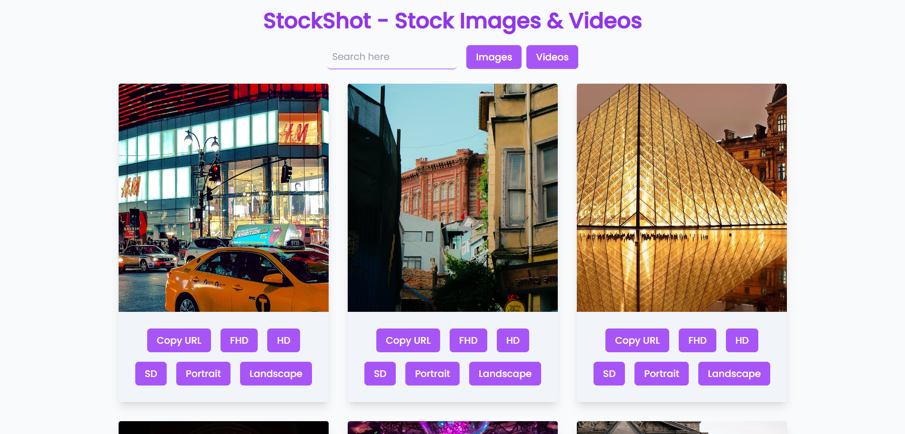

# StockShot

A modern web app for browsing and managing media, built with React, Vite and Tailwind CSS.

## Features

- Fast and responsive UI
- Media browsing and pagination
- Error handling and loading states
- Debouncing on API calls

## Getting Started

1. Clone the repository
2. Install dependencies: `npm install`
3. Start the development server: `npm run dev`

## Live Demo

[View the app](https://stockshot.vercel.app/)
